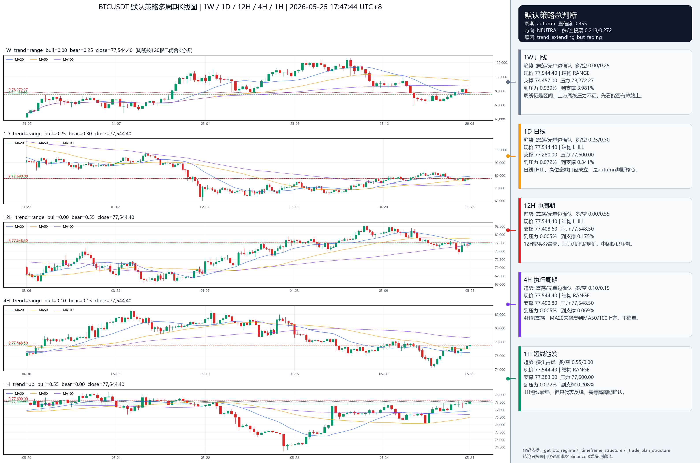
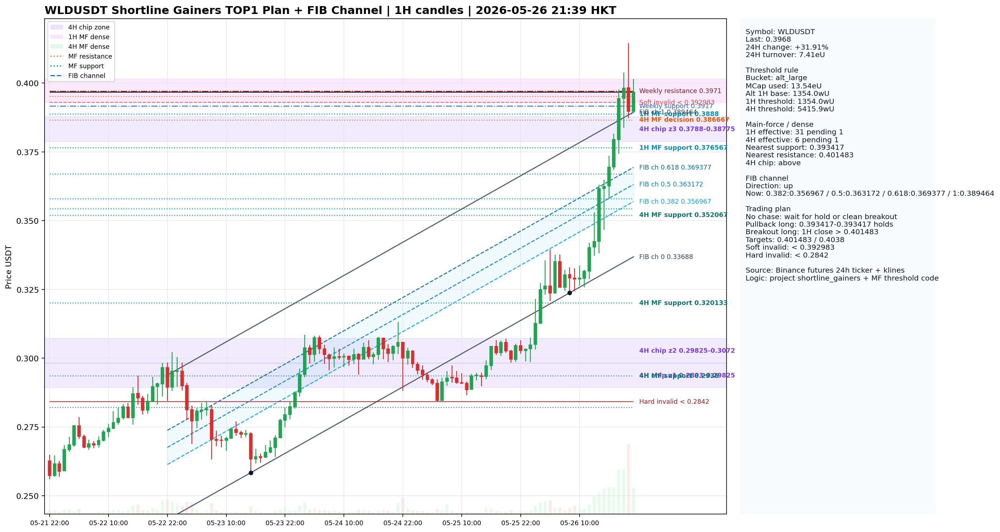
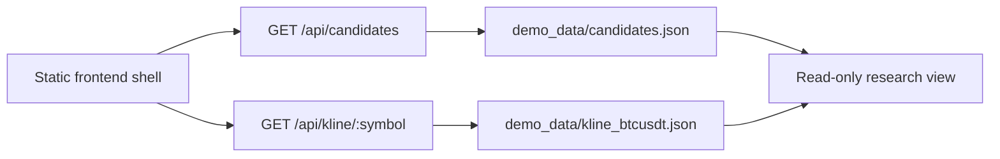

# ONX Research Workbench Demo


[中文说明](README.zh-CN.md) · [Architecture](docs/architecture.md) · [Case Study](docs/case-study.md) · [Sanitization Policy](docs/sanitization-policy.md)

I built this repository as the public, sanitized demo for the private `codex`
branch of my research system. The private branch contains a richer visual
terminal; this demo keeps the publishable full-stack shape: a read-only frontend
shell, a minimal Python JSON service, synthetic API fixtures, documentation,
tests, CI, and a clear public/private data boundary.

This is not a live trading console. It cannot place orders, cancel orders,
modify leverage, mutate account state, or read private production caches.


## Example Outputs

I moved two sanitized example outputs from my private `codex` branch into this
demo so reviewers can see the kind of chart interpretation the workbench is
designed to organize.

### BTCUSDT Multi-Timeframe Structure



I use this output to show multi-timeframe BTCUSDT structure review across weekly,
daily, 12H, 4H, and 1H contexts.

### WLDUSDT Shortline FIB Channel Plan



I use this output to show shortline gainer review with main-force
support/resistance zones, FIB channel levels, and a read-only trade-plan summary.

Read the full explanation in [Example output notes](docs/example-output-notes.md).

## What I Am Demonstrating

I use this demo to show how I turn a research-heavy backend workflow into a
readable product surface.

| Area | What I built in this demo | What it demonstrates |
| --- | --- | --- |
| Product shell | Static dashboard-style frontend under `frontend/` | I can design dense operational UI for repeated research use. |
| API boundary | Minimal Python JSON service under `backend/app/` | I can expose data through explicit read-only contracts. |
| Data contracts | Synthetic candidate and K-line fixtures under `demo_data/` | I can separate frontend needs from private runtime state. |
| Safety model | No mutation routes and documented security boundary | I design product surfaces around risk constraints. |
| Documentation | Architecture, case study, API contract, walkthrough, and sanitization policy | I make a project understandable without private context. |
| Quality gate | Unit tests and GitHub Actions workflow | I keep the demo verifiable with a small dependency surface. |

## Architecture Snapshot



My private workbench has more screens, richer charting, and deeper data
adapters. In this demo I kept the interface contract and product thinking while
removing private state, credentials, and production services.

## Local Preview

```powershell
python backend/app/main.py
```

Then open:

```text
http://127.0.0.1:8765/
http://127.0.0.1:8765/api/candidates
http://127.0.0.1:8765/api/kline/BTCUSDT
```

Run the validation suite:

```powershell
python -m unittest discover -s tests
```

## Repository Map

| Path | Purpose |
| --- | --- |
| `frontend/` | Static read-only research workbench shell |
| `backend/app/` | Minimal Python service exposing synthetic JSON contracts |
| `demo_data/` | Synthetic candidate, K-line, and scenario fixtures |
| `docs/` | Architecture, API contract, walkthrough, case study, and sanitization policy |
| `tests/` | Contract tests and public fixtures |
| `.github/workflows/` | Lightweight CI validation |

## Why This Is a Demo

I intentionally reduced the workbench before publishing it:

- I replaced private data sources with synthetic JSON fixtures.
- I removed account pages that would require private context.
- I kept the frontend layout, API contract style, read-only boundary, tests, and documentation visible.
- I wrote the history as a curated public demo history instead of exposing private runtime commits.

## Documentation

- [Architecture](docs/architecture.md)
- [API contract](docs/api-contract.md)
- [Demo walkthrough](docs/demo-walkthrough.md)
- [Full-stack scope](docs/full-stack-scope.md)
- [Case study](docs/case-study.md)
- [Sanitization policy](docs/sanitization-policy.md)
- [Release notes](RELEASE_NOTES.md)

## Public Boundary

I maintain this repository for portfolio review and technical communication. I
do not present it as a production trading terminal, an investment-advice product,
or a system connected to live accounts.
