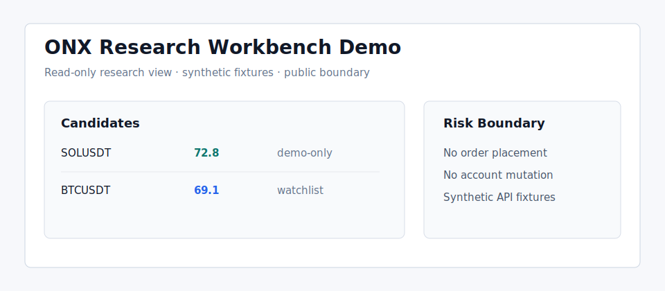

# ONX Research Workbench Demo


[English README](README.md) · [架构说明](docs/architecture.md) · [案例复盘](docs/case-study.md) · [脱敏策略](docs/sanitization-policy.md)

我把这个仓库做成私有 `codex` 分支的公开脱敏演示版。私有分支里有更完整的可视化研究终端；
我只在这个 demo 中保留适合公开展示的全栈形态：只读前端壳、最小 Python JSON 服务、合成 API 样本、
文档、测试、CI，以及明确的公开/私有数据边界。

这不是实盘交易控制台。它不能下单、撤单、修改杠杆、变更账户状态，也不会读取私有生产缓存。



## 我想展示什么

我用这个 demo 展示自己如何把研究型后端流程产品化成可阅读、可复核、只读优先的全栈界面。

| 能力面 | demo 中的实现 | 体现的能力 |
| --- | --- | --- |
| 产品界面 | `frontend/` 下的静态 dashboard 壳 | 我能设计适合反复研究使用的高密度操作界面。 |
| API 边界 | `backend/app/` 下的最小 Python JSON 服务 | 我能用明确的只读合约暴露数据。 |
| 数据契约 | `demo_data/` 下的合成候选和 K 线样本 | 我能把前端需求和私有运行状态隔离。 |
| 安全模型 | 无写入路由，并有安全边界文档 | 我会围绕风险约束设计产品表面。 |
| 文档体系 | 架构、案例、API 合约、walkthrough、脱敏策略 | 项目不依赖私有背景也能被理解。 |
| 质量门禁 | 单元测试和 GitHub Actions | 小依赖面也保留可验证性。 |

## 本地预览

```powershell
python backend/app/main.py
```

然后访问：

```text
http://127.0.0.1:8765/
http://127.0.0.1:8765/api/candidates
http://127.0.0.1:8765/api/kline/BTCUSDT
```

运行测试：

```powershell
python -m unittest discover -s tests
```

## 仓库结构

| 路径 | 作用 |
| --- | --- |
| `frontend/` | 静态只读研究工作台界面 |
| `backend/app/` | 暴露合成 JSON 合约的最小 Python 服务 |
| `demo_data/` | 合成候选、K 线和场景样本 |
| `docs/` | 架构、API 合约、walkthrough、案例复盘和脱敏策略 |
| `tests/` | 合约测试和公开 fixture |
| `.github/workflows/` | 轻量 CI |

## 为什么是 demo

我在公开前有意降级：

- 用合成 JSON fixture 替换私有数据源。
- 移除需要私有上下文的账户页面。
- 保留前端布局、API 合约风格、只读边界、测试和文档。
- 使用整理后的公开 demo 提交历史，而不是暴露私有运行提交。

## 文档入口

- [架构说明](docs/architecture.md)
- [API 合约](docs/api-contract.md)
- [演示 walkthrough](docs/demo-walkthrough.md)
- [全栈能力映射](docs/full-stack-scope.md)
- [案例复盘](docs/case-study.md)
- [脱敏策略](docs/sanitization-policy.md)
- [Release notes](RELEASE_NOTES.md)

## 公开边界

我维护这个仓库仅用于作品集展示和技术沟通；我不把它作为生产交易终端、
投资建议产品，也不让它连接真实账户。
