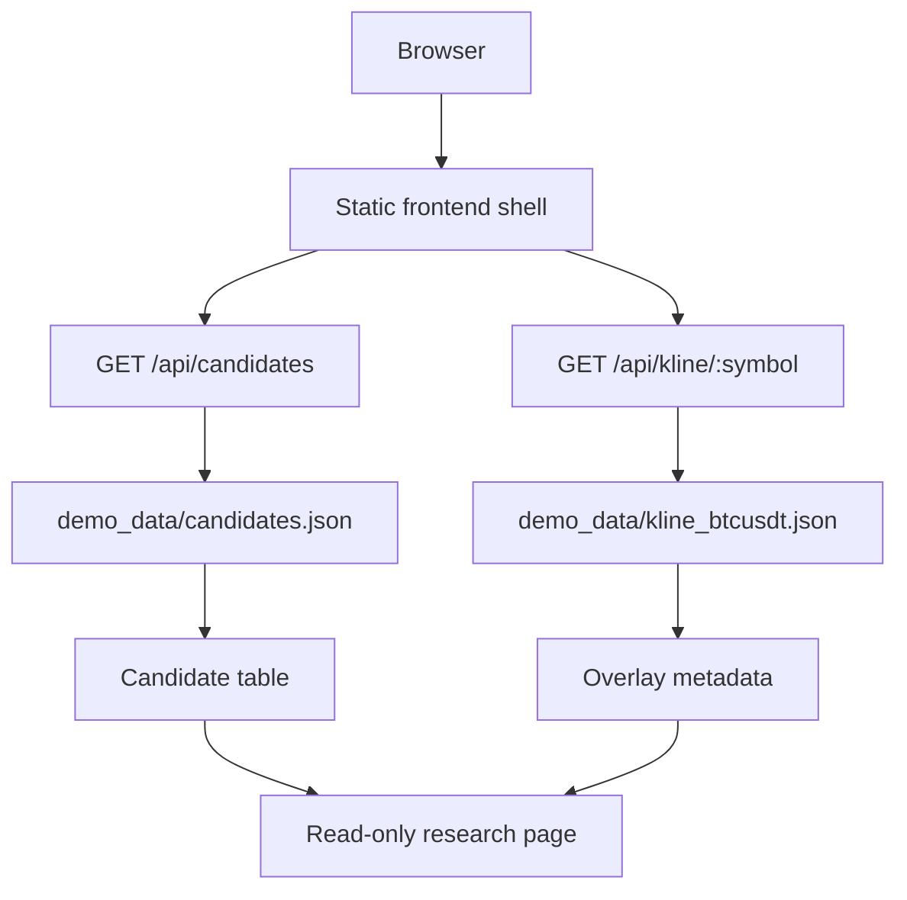

# Architecture

I designed this public demo as a read-only full-stack slice of my private visual
research workbench. The goal is to show the product and API structure without
publishing private caches, account context, or production services.

## System Flow

## Module Boundary

| Area | Responsibility | Why I kept it separate |
| --- | --- | --- |
| `frontend/index.html` | UI structure and content hierarchy | The product shell is readable without a build system. |
| `frontend/styles.css` | Dense, work-focused styling | I keep the UI utilitarian instead of marketing-like. |
| `frontend/app.js` | Client-side data loading and rendering | The browser code stays small and inspectable. |
| `backend/app/main.py` | Read-only HTTP routes | API behavior is explicit and easy to test. |
| `backend/app/demo_repository.py` | Fixture loading | Data access is isolated from route handling. |
| `demo_data/` | Synthetic public fixtures | Private runtime data never enters the public repository. |
| `tests/` | Contract checks | The demo verifies the data boundary and API assumptions. |

## Product Boundary

The private workbench contains more views and richer charting. This public demo
keeps only the shell needed to communicate the architecture:

- candidate queue,
- risk summary,
- synthetic API contracts,
- read-only service boundary,
- and documentation for reviewers.

## 中文摘要

我把这个公开 demo 设计成私有可视化研究台的只读全栈切片：前端负责高密度研究界面，
后端负责合成 JSON 合约，数据层只读取公开 fixture。这样能展示产品化和 API 设计，
又不公开私有缓存、账户上下文或生产服务。
